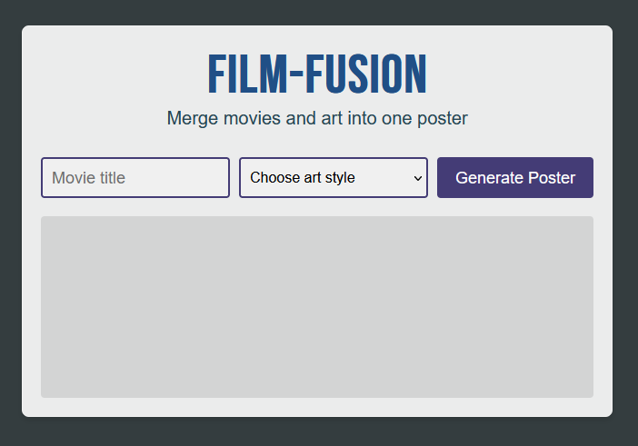

# Film Fusion



## Overview

Film Fusion is a unique web application that merges movies and art into a single poster. By leveraging OpenAI's DALL-E model, the app creates stunning and imaginative posters that combine elements from different films and artistic styles. This project is developed using vanilla JavaScript with Vite, along with HTML and CSS for the frontend.

## Features

- **Movie and Art Fusion**: Merge elements from different movies and artistic styles into a single poster.
- **User-Friendly Interface**: A simple and intuitive interface for easy navigation and interaction.
- **Dynamic Poster Generation**: Real-time poster generation using OpenAI's DALL-E model.
- **Customizable Inputs**: Allow users to input their favorite movies and art styles to create personalized posters.

## Technologies Used

- **HTML**: For structuring the web pages.
- **CSS**: For styling the application.
- **JavaScript**: For application logic and interaction.
- **Vite**: A fast build tool and development server for modern web projects.
- **OpenAI DALL-E**: For generating the artistic posters.

## Installation

Follow these steps to set up the project locally:

1. **Clone the repository:**

   ```bash
   git clone https://github.com/wasaanyi/film-fusion.git
   cd film-fusion
   ```

2. **Install dependencies:**

   ```bash
   npm install
   ```

3. **Set up environment variables:**

   Create a `.env` file in the root directory and add your OpenAI API key:

   ```bash
   VITE_OPENAI_API_KEY=your_openai_api_key
   ```

4. **Start the development server:**

   ```bash
   npm run dev
   ```

5. **Build the project for production:**

   ```bash
   npm run build
   ```

6. **Preview the production build:**

   ```bash
   npm run preview
   ```

## Usage

1. **Enter Movie and Art Details**: Provide the names of the movies and the desired art style in the input fields.
2. **Generate Poster**: Click on the "Generate Poster" button to create a unique movie-art fusion poster.
3. **View and Save**: View the generated poster and save it if desired.

## Contributing

Contributions are welcome! If you have any ideas, suggestions, or bug reports, please open an issue or submit a pull request. When contributing, please follow the established code style and conventions.

## License

This project is licensed under the MIT License. See the [LICENSE](./LICENSE) file for more details.

## Acknowledgments

- [OpenAI](https://openai.com) for providing the DALL-E model.
- [Vite](https://vitejs.dev) for the fast build tool and development server.
- [JavaScript](https://developer.mozilla.org/en-US/docs/Web/JavaScript) for the scripting language.
- [HTML](https://developer.mozilla.org/en-US/docs/Web/HTML) and [CSS](https://developer.mozilla.org/en-US/docs/Web/CSS) for the web technologies.

## Contact

If you have any questions or feedback, feel free to reach out:

- **Email**: your-email@example.com
- **GitHub**: [wasaanyi](https://github.com/wasaanyi)
